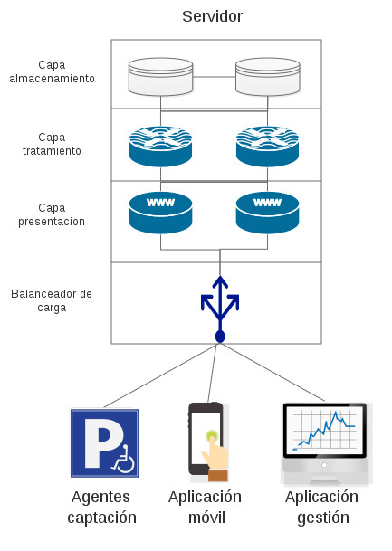

# Buscar una aplicación de ejemplo, preferiblemente propia, y deducir qué patrón es el que usa. ¿Qué habría que hacer para evolucionar a un patrón tipo microservicios?

La aplicación buscada ha sido mi TFG (SIGA) que está por liberar donde diseñé una arquitectura cliente-servidor donde el servidor está diseñado en capas tal y como se puede ver en la siguiente figura.

La capa de presentación es, en realidad, una API Rest donde se conectan las diferentes aplicaciones (agentes, aplicación móvil y de gestión) que hace de enlace con la capa de tratamiento de la información. Esta capa es la encargada de asegurar todas las peticiones, validar los permisos y parsear los datos.

La segunda capa, la de tratamiento, lleva a cabo la lógica de negocio e interactúa con la capa de almacenamiento donde se encuentran guardados los datos deł sistema. Esta dos últimas capas son el cuello de botella del sistema.

Para mejorar el sistema a un patrón de microservicios habría que separar cada una de las entidades, con su lógica de negocio y su almacenamiento, a servicios distintos. De esta forma distribuimos los datos y la carga computacional que requiere tratarlos.

Dichas entidades (usuarios, aparcamientos, histórico, valoraciones...) están relacionadas unas con otras por lo que los microservicios deberían estar relacionados y mandarse peticiones unos a otros.