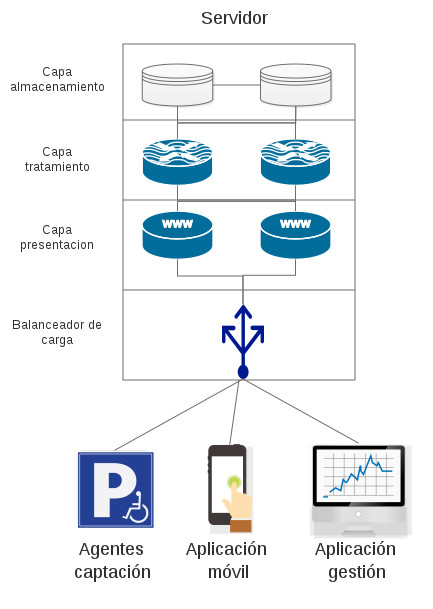

# Buscar una aplicación de ejemplo, preferiblemente propia, y deducir qué patrón es el que usa. ¿Qué habría que hacer para evolucionar a un patrón tipo microservicios?

La aplicación buscada ha sido mi TFG (SIGA) que está por liberar donde diseñé una arquitectura cliente-servidor donde el servidor está diseñado en capas tal y como se puede ver en la siguiente figura.

La capa de presentación es, en realidad, una API Rest donde se conectan las diferentes aplicaciones (agentes, aplicación móvil y de gestión) que hace de enlace con la capa de tratamiento de la información. Esta capa es la encargada de asegurar todas las peticiones, validar los permisos así como los datos. La segunda capa, la de tratamiento, lleva a cabo la lógica de negocio e interactúa con la capa de almacenamiento donde se encuentran guardados los datos deł sistema. Estas dos últimas capas son el cuello de botella del sistema.

En estas tres capas se mezclan todas las entidades de la aplicación. Dichas entidades son: plazas, ubicaciones y usuarios; pero la idea es ampliar más esta funcionalidad básica añadiendo históricos, valoraciones, incidencias... Antes de aumentar esta aplicación es necesario dedicar algo de tiempo para diseñar su arquitectura y que así sea más fácil añadir funcionalidades o escalar la propia aplicación, o partes de esta, en caso de recibir más peticiones que la aplicación pueda soportar.

Para ello, mejorar el sistema a un patrón de microservicios sería la solución ya que es un patrón que permite el escalado fácilmente así como la adicción de nuevas funcionalidades. Para poder hacer varios microservicios habría que separar cada una de las entidades, con su lógica de negocio y su almacenamiento, a servicios distintos. De esta forma distribuimos los datos y la carga computacional que requiere tratarlos. Dichas entidades están relacionadas unas con otras por lo que los microservicios deberían estar relacionados y mandarse peticiones unos a otros.

Esta relación podría darse de forma asíncrona a través de un sistema de mensajería de cola de eventos por lo que sería más fácil escalar cualquier parte de la aplicación.
