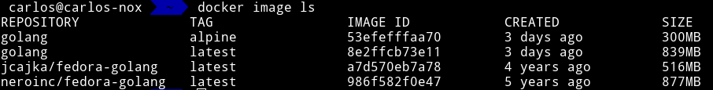
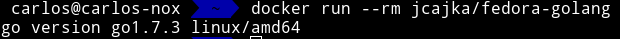
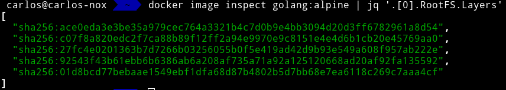
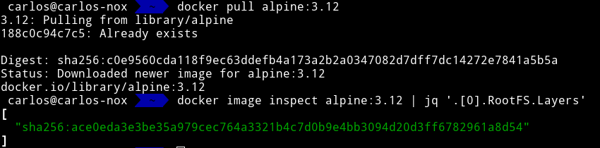

# Comparación imágenes de docker

Para este ejercicio me voy a basar en [las imágenes que se han buscado](https://github.com/kcobos/SIGA-Cloud/blob/main/README.md#Dockerize-for-testing) para el proyecto [SIGA](https://github.com/kcobos/SIGA). Para que sea más cómodo, copiemos aquí la lista de imágenes:

- **golang**:
  - normal ([debian buster](https://github.com/docker-library/golang/blob/a7f393378d8566caf777ad2e6b9dc9d014875a88/1.15/buster/Dockerfile)).
  - [alpine](https://github.com/docker-library/golang/blob/a7f393378d8566caf777ad2e6b9dc9d014875a88/1.15/alpine3.12/Dockerfile).
- **neroinc/fedora-golang**:
  - [normal](https://github.com/NeroINC/docker/blob/master/fedora-golang/Dockerfile).
- **jcajka/fedora-golang**:
  - [normal](https://github.com/jcajka/fedora-golang/blob/master/f25/Dockerfile).

Para empezar, podemos comparar el tamaño de las diferentes imágenes. Para ello y debido a que las imágenes *neroinc/fedora-golang* y *jcajka/fedora-golang* no tienen un tamaño en <hub.docker.com>, vamos a descargar las distintas imágenes y ver su tamaño descomprimidas.

Una vez descargadas las imágenes con `docker pull` podemos ver el tamaño de estas con `docker images` o `docker image ls` como se demuestra en la siguiente imagen:

En la imagen superior podemos ver que la imagen docker que menos tamaño tiene es *golang:alpine*, ocupando tan solo 300 MB. También podemos percatarnos de que la imágenes no oficiales (las que no son de *golang*) han sido actualizadas anteriormente por lo que nos da un indicio de que pueden estar más desactualizadas.

Para corroborar este último dato podemos ver los distintos *dockerfile* y asi ver qué versión del lenguajes utilizan:

- **golang**:
  - normal ([debian buster](https://github.com/docker-library/golang/blob/a7f393378d8566caf777ad2e6b9dc9d014875a88/1.15/buster/Dockerfile)): 1.15.6
  - [alpine](https://github.com/docker-library/golang/blob/a7f393378d8566caf777ad2e6b9dc9d014875a88/1.15/alpine3.12/Dockerfile): 1.15.6
- **neroinc/fedora-golang**:
  - [normal](https://github.com/NeroINC/docker/blob/master/fedora-golang/Dockerfile): 1.4
- **jcajka/fedora-golang**:
  - [normal](https://github.com/jcajka/fedora-golang/blob/master/f25/Dockerfile): 1.7.3 (la que trae Fedora por defecto. Ver la siguiente figura)

Con esto hemos demostrado que las imágenes elegidas que no son oficiales ejecutan una versión más antigua del lenguaje de programación.

Por ahora la image *golang:alpine* tiene la última versión del lenguaje de programación y es la que menos ocupa debido a que está basada en la distribución [alpine](https://alpinelinux.org/about/).

También podemos ver si realmente la imagen se ha creado con el *dockerfile* que adjunta. Para ello podemos sacar información de las capas de la imagen y de las capas que tiene que tener según el *dockerfile*.

Según la [documentación oficial de docker para los *dockerfiles*](https://docs.docker.com/develop/develop-images/dockerfile_best-practices/#minimize-the-number-of-layers) "*solo las instrucciones `RUN`, `COPY` y `ADD` crean capas en la imagen*" y como podemos ver en el *[dockerfile](https://github.com/docker-library/golang/blob/a7f393378d8566caf777ad2e6b9dc9d014875a88/1.15/alpine3.12/Dockerfile)* de *golang:alpine*, solamente hay 4 instrucciones `RUN` y ningún `COPY` o `ADD` luego, dicha imagen tiene que tener tan solo 5 capas, 4 de ellas creadas por estos comandos y la quinta capa es la capa base de *alpine:3.12*. Para comprobar esto podemos ejecutar `docker image inspect golang:alpine | jq '.[0].RootFS.Layers'` para ver de manera empírica las capas de la imagen.

Para corroborar que la primera capa es la de *alpine:3.12*, nos podemos bajar dicha imagen y ver sus capas. Esta imagen solo tiene que tener una capa nada más que corresponderá a la primera capa de la imagen de *golang:alpine*.

Como podemos ver, la imagen de *alpine* tiene tan solo una capa y el hash de esta coincide con la primera de *golang:alpine*.

Por último podemos decir que esta imagen no trae ningún usuario, excepto *root*, debido a que no se crea en el *dockerfile* de *golang:alpine* y [alpine no trae ningún usuario por defecto](https://wiki.alpinelinux.org/wiki/Alpine_newbie_apk_packages#New_users:_management_of_users_and_logins).
