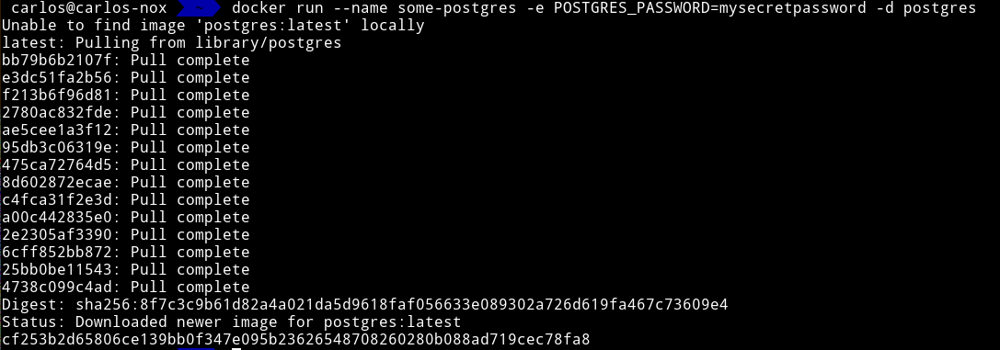
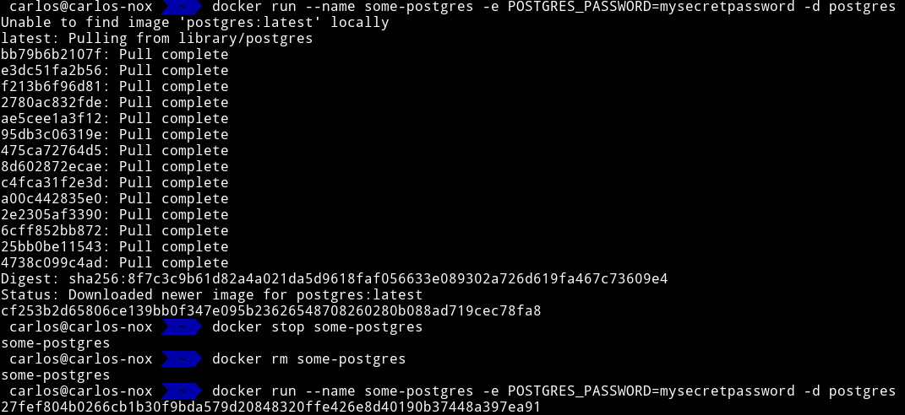

# Buscar alguna demo interesante de Docker y ejecutarla localmente, o en su defecto, ejecutar la imagen anterior y ver cómo funciona y los procesos que se llevan a cabo la primera vez que se ejecuta y las siguientes ocasiones.

Para hacer este ejercicio, voy a elegir una imagen de una base de datos (que son muy comunes). Más en concreto la BBDD de [PostgreSQL](https://hub.docker.com/_/postgres).

Para ejecutarla por primera vez basta con seguir los pasos de la documentación de la imagen:

```bash
docker run --name some-postgres -e POSTGRES_PASSWORD=mysecretpassword -d postgres
```



La primera vez que se ejecuta PostgreSQL en Docker, este se tiene que bajar la imagen del contenedor. Esta imagen puede estar dividida en varias capas (es común que lo esté). Dichas capas son para separar estados o cambios de las imágenes. Normalmente, un estado se crea al ejecutar una acción del fichero de creación de la imagen: **dockerfile**.

La segunda vez que se ejecuta la imagen, docker ya la tiene descargada por lo que su ejecución es inmediata:


