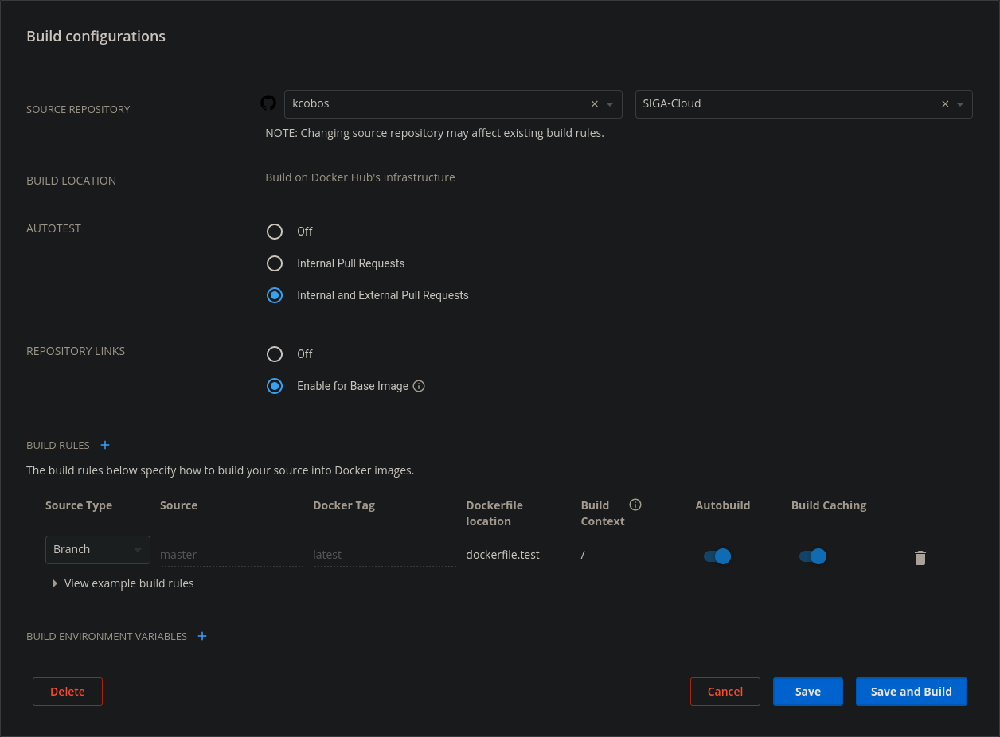

# Configurar repositorio de imágenes de docker en Dockerhub

Lo primero que hay que hacer obligatoriamente es crear una cuenta en <https://hub.docker.com/>. Una vez creada la cuenta, en <https://hub.docker.com/settings/linked-accounts> podemos enlazar la cuenta de Dockerhub con la de Github dándole al botón *Connect* e iniciando sesión en Github para dar permisos a que Dockerhub acceda a la información de nuestra cuenta de Github.

Con esa sencilla configuración ya podemos crear nuestro primer repositorio en Dockerhub, repositorio para imágenes de Docker. Yo he creado uno con el mismo nombre que del repositorio de Github donde estoy realizando el proyecto de la asignatura.

Una vez creado el repositorio ya podríamos iniciar sesión en en CLI de docker y subir la imagen que queramos. Con `docker login` iniciamos sesión y con `docker push` subiríamos la imagen.

Pero de esta forma cada vez que hagamos un cambio tendremos que subir el código a Github, volver a crear la imagen y subir esta última a Dockerhub. En este proceso nos podemos confundir al crear la imagen o subirla. Por esta razón vamos a automatizar que siempre que subamos algo a Github se cree la imagen y se publique. Para ello editamos el repositorio creado y en la pestaña de *Builds* podemos configurar desde qué repositorio de Github se va a crear y cómo lo va a hacer.

En mi caso he seleccionado el repositorio de Github que contiene los fuentes que van a crear la imagen o imágenes para este repositorio. Después he seleccionado la opción de auto-comprobación para que la imagen sea más fiable para la comunidad, también he seleccionado que se reconstruya la imagen automáticamente si cambia la imagen base y he creado las reglas de construcción, en mi caso una.

Dicha regla construye la imagen *latest* desde el archivo *dockerfile.test* cuando se cambia la rama *master* de Github.