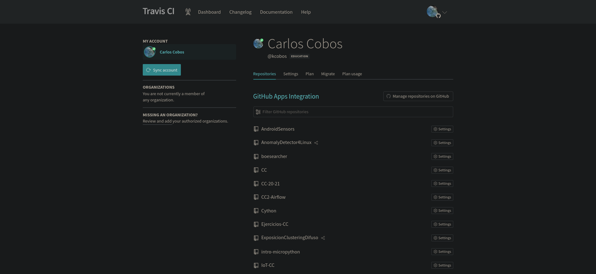
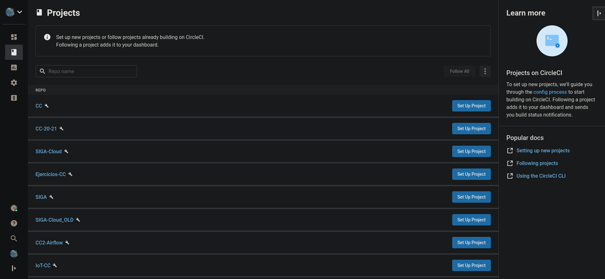
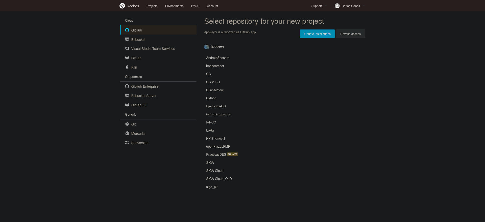

# Haced los dos primeros pasos antes de pasar al tercero en un repositorio de nuestra elección, tal como el del proyecto que se hace para la asignatura (que se hará en el ejercicio siguiente)

1. Darse de alta. Muchos están conectados con GitHub por lo que puedes autentificarte directamente desde ahí. A través de un proceso de autorización, puedes acceder al contenido e incluso informar del resultado de los tests a GitHub.

TravisCI

CircleCI

AppVeyor

2. Activar el repositorio en el que se vaya a aplicar la integración continua. Travis permite hacerlo directamente desde tu configuración; en otros se dan de alta desde la web de GitHub.

Para TravisCI se tiene que crear un fichero de nombre `.travis.yml` en el raíz del repositorio y directamente se activa el repo en el sistema de integración. Tanto para CircleCI como para AppVeyor hay que activar el repo en el sistema el cual proporciona un fichero de configuración que habrá que subirlo al repositorio al igual que el de Travis.
